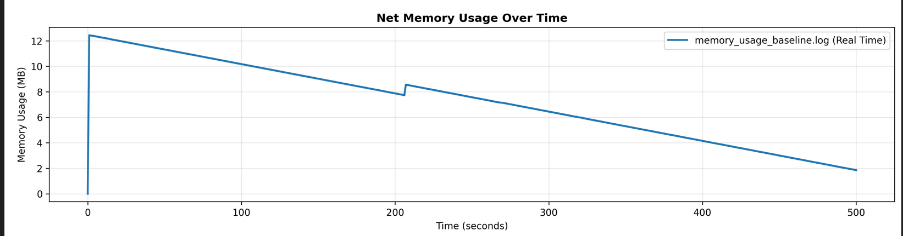
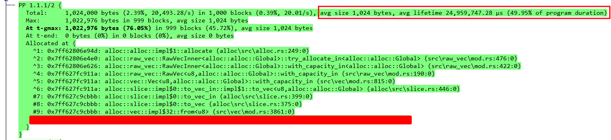
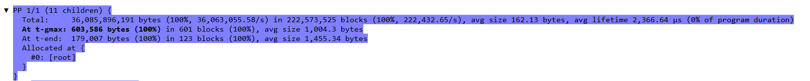
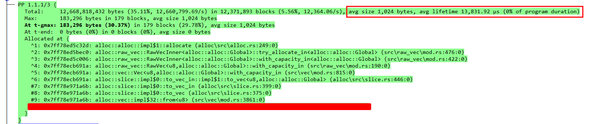
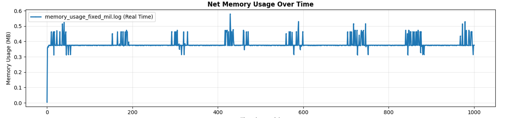

+++
title = "A memory profiling journey"
description="I walk through the process of discovering the consequences of not having backpressure in a system"
date = 2025-06-21

[taxonomies]
categories = ["programming", "rust", "profiling"]

[extra]
+++

# Prelude

Imagine if you will, that you want to create a library for sending a message to an external service. This service provides an API client library which you plan on using. This library has an API that which looks a little something like this:

```rust

pub struct Producer {
  //
}

impl Producer {
  pub fn new() -> Self {}

  pub async fn produce(message: Message) -> Result<(), Error> {}

  pub async fn produce_batch(message: Message) -> Result<(), Error> {}
}
```

And a contrived example of using this API might look like this:

```rust

async fn produce_message(key: String, payload: Vec<u8>) -> Result<(), String> {
  let producer = Producer::new("http://example.endpoint");

  if let OK(_) = producer.produce(key, payload).await {
    return Ok(());
  } else {
    return Err("Error sending message to API".into())
  }
}
```

The specifics of the underlying protocol don't matter. The main behavior that the API client exposes is two `async` methods that make the requests, and wait for a response before returning control back to the caller. While the method won't block the entire thread when it is waiting for a response, the task that is executing the future generated by this method will be suspended until the underlying IO object notifies the runtime that a response came through. Therefore, functionally, when called from another `async` context, the task is blocking.

Additionally, say you want to provide a for your users.

    This could be for a variety of reasons, maybe your users are calling your library from another language over an FFI layer. Maybe you just don't want to deal with the <a href="https://journal.stuffwithstuff.com/2015/02/01/what-color-is-your-function/">Function coloring problem</a>

To address this, you reach for a fairly standard solution -- spawn a background task on a runtime that you initialize:

```rust
use std::sync::mpsc;

pub struct Telegrapher {
    tx: mpsc::Sender<Message>,
}

impl Telegrapher {
    pub fn new(endpoint: String) -> Self {
        let producer = Producer::new(endpoint);

        let (tx, rx) = mpsc::channel::<Message>();

        thread::spawn(|| {
            while let Some(message) = rx.recv() {
                // Gets a handle to ~~Some~~ runtime
                get_runtime().block_on(async {
                    producer
                        .produce(message)
                        .await
                        .expect("We're ignoring error handling for now");
                });
            }
        });

        Self { tx }
    }

  pub fn send_message(data: &[u8]) -> Result<(), Error> {
    // Internally allocates a vec and copies data into it
    let encoded_message = Message::from(data);
    self.tx.send(encoded_message)
  }
}

```

> The actual code is a little different, plus I've changed the names. So if you see some redacted lines, assume that it's some internal implementation details that are not relevant to the subject.

Nice! You now have a simple library you can ship off to customers, you can even use [bindgen][bindgen] to generate a C library which can be used by consumers from other language ecosystems. Happy, you mark your task closed and move on with your life. But reader, did you catch the mistakes lurking in the previous snippet?

Soon, a customer reaches out to you, calling out that your library is using more memory than their resource limits allow. They are running on a resource constrained embedded system, and your library is using 25 MB of the 50 MB memory budget that they have available, and therefore they are unable to service user requests. And thus starts a very fun investigation that I found myself performing over the last week.

[bindgen]: https://github.com/rust-lang/rust-bindgen

# Establishing a baseline

In order to understand whether or not improvements could be made, I first need to establish a baseline. This can be done using two main tools on Windows, [dhat-rs][dhat-rs], and the [stats_alloc][stats-alloc] crate. To start with, I wrote a simple program that sends 1000 1KB messages using the library.

The `stats_alloc` crate provides an instrumented allocator that monitors all allocation and de-allocation operations performed globally within the process. It exposes an API to get the latest snapshot numbers, which when graphed over time provide a picture of the memory usage of the program at different points of time. In my code, I just spawned a background thread to call this API and write the timestamp, along with the data as a csv file to disk. Putting this functionality behind a feature gate ensured that I could use a specific profiler for different program runs. Once the program finished execution, I wrote a python script to plot the allocations vs deallocations which resulted in the following graph



As we can see, the memory usage spikes immediately to over 12 MB and slowly trails off until the end of the program. While this did not raise any alarm bells in my head when I first saw it, in hindsight the problem is glaringly obvious, especially when paired with the output of dhat

dhat-rs is rust port of Valgrinds DHAT, a heap profiler, and the profiles it generates can be used with the [`dhat-viewer`](https://nnethercote.github.io/dh_view/dh_view.html) website.

    In this example, I'm only focusing on the `t-gmax` allocation stacks, but the data can be used to learn a whole host of other information regarding the execution of a program. I'm barely even scratching the surface here. The only con is that program execution slows down significantly when using the profiler.

 but the main information I gleaned from it was the `t-max` sort option, which shows the allocations sorted by size during the max size of the program heap. The [instruction][dhat-instructions] for the library are great, and I quickly set up the profiler behind a second feature flag. Running the same test program created a `dhat-profile.josn` in the workind directory which I loaded into the viewer. Immediately this particular stack trace stood out once I sorted the view by `t-gmax`.



The viewer also provides some key information right at the top of the profile output:

```json
Times {
  t-gmax: 58,261 µs (0.12% of program duration)
  t-end:  49,967,598 µs
}
```
where `t-gmax` is the timestamp of the max heap utilization and `t-end` is the timestamp at which the program finished executing.

[stats-alloc]: https://docs.rs/stats_alloc/latest/stats_alloc/
[dhat-rs]: https://docs.rs/dhat/latest/dhat/
[dhat-instructions]: https://docs.rs/dhat-rs

# The culprit

With graph and the dhat profile in hand, we can start to see a pattern.

- Almost all of the memory used by the program is allocated at the very beginning of the program execution.
- On average most of the allocated memory is alive for at least 50% of the programs runtime.

In order to understand why most of the allocations are alive for so long, I wanted to understand the flow of data through the system. Looking at the data flow, these are the steps that the data takes:

- `Vec<u8>` created by copying contents of the payload when sending the message
- Message sent to a background thread spawned per `Telegrapher`.
- Background thread moves the message into the actual `produce` call.
- The thread function gets a handle to the runtime and `block_on`'s the `produce` call.
- The produce call internally sends the message to an actor which buffers and encodes the request.

Once these steps were clear, I added a `created_time` field to the `Message` struct to track the time it spent in the various queues. And this immediately identified the issue. The messages were sitting in the queue spawned by the `Telegrapher::new` method for most of the lifetime of the program.

Digging further into this gave the full picture:

- The `Telegrapher::new` method created a background thread, and set up a **unbounded** queue for sending messages to it.
- When callers used the `Telegrapher::send_message` method, it was non-blocking, and did not provide any form of backpressure to the caller.
  - This meant that if you had a 1000, or a 100_000 messages, all of them would quickly be allocated and added to queue.
- Finally, the background thread spawned by the constructor would process messages on the queue, _one at a time_ calling `block_on` on the runtime handle.

This effectively meant that every the final message added to the queue would have to wait `1000 * avg_req_time_ms` milliseconds in the queue. This is exactly in line with what the dhat profile and the graph from the `stats_alloc` dat showed me. The lack of brakpressure and no batching caused the allocations to live for far longer than they were necessary.

# The fixes

To fix the issue, I made the following changes:

- Refactor `Telegrapher::new`
  - Use a bounded `tokio::sync::mpsc` channelwith a user configurable limit.
  - Spawn a background task on the runtime directly per `Producer` object to process messages for that producer instead of a thread.
    - This has the additional benefit of reducing resource useage as tasks are far more lightweight than OS threads.
  - Within the background task, use the [`recv_many`][recv-many] API with a user configurable limit to pull messages from the queue.
  - Use the `Producer::produce_batch` API to make a batch request instead of individual requests.
- Update `Telegrapher::send_message` to return an error when the queue is full.

[recv-many]: https://docs.rs/tokio/latest/tokio/sync/mpsc/struct.Receiver.html#method.recv_many

These changes are primarily focused on two levers: throughput and backpressure. By using batching APIs for making the request, we are able to process

    A great additional benefit of using batching APIs is that it speeds up the over execution time. When running tests locally, the baseline version of the test program took 8 minutes on average to execute. After the fixes, it took 16 seconds. Plus, I could run workloads of up to a million messages within a few minutes vs the program taking hours previously.
 And by using a bounded channel, and applying backpressure via our public API, we ensure that we always use a deterministic amount of resources and remove any change of unbounded growth. By switching to a bounded channel, we limit the overall memory usage of our system to `O(message_size * queue_size)`.

After setting defaults values for the queue size and batch size (128 and 64 respectively), I re-ran the test program, this time with a workload of sending 1 million 1KB messages. The dhat profile showed the peak memory usage of the program was a little over 600 KB



Where `t-gmax` was actually at the end of the program

```json
Times {
  t-gmax: 999,810,687 µs (99.92% of program duration)
  t-end:  1,000,633,352 µs
}
```

Even after the fixes, the main culprit for most of the resource useage comes from the messages sitting in the queue, but the memory usage is a _lot_ lower, and they are only alive for 13,831.92 µs.



Finally, the graph from the stats_alloc data paints the complete picture



As we can see, the memory usage of the program hovers around 400 KB, occasionally going up to 600 for brief durations. This lines up with memory allocation stacks for the messages sitting in the queue being processed by the background task, as see in the dhat profile screenshot above. This stack now contributes to 183 KB of the memory usage.

# Conclusion

Backpressure is important in systems. And personally, I've come to the conclusion that using unbounded channels anywhere is a major red flag. Backpressure allows callers to set up relief valves to enable smooth operations of the systems without one portion of the either taking up all of the resources or falling over without being able to handle the load. Additionally, using `block_on` is another (albiet minor) code smell. Most often, a background task with a channel is a better tool to reach for when bridging async and sync code.

Finally, dhat-rs and stas_alloc are excellent tools, especially in Windows land.