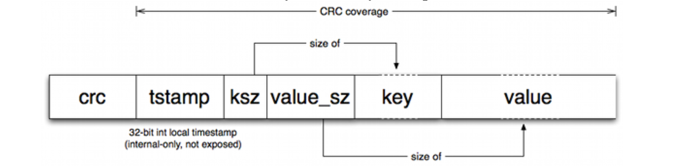
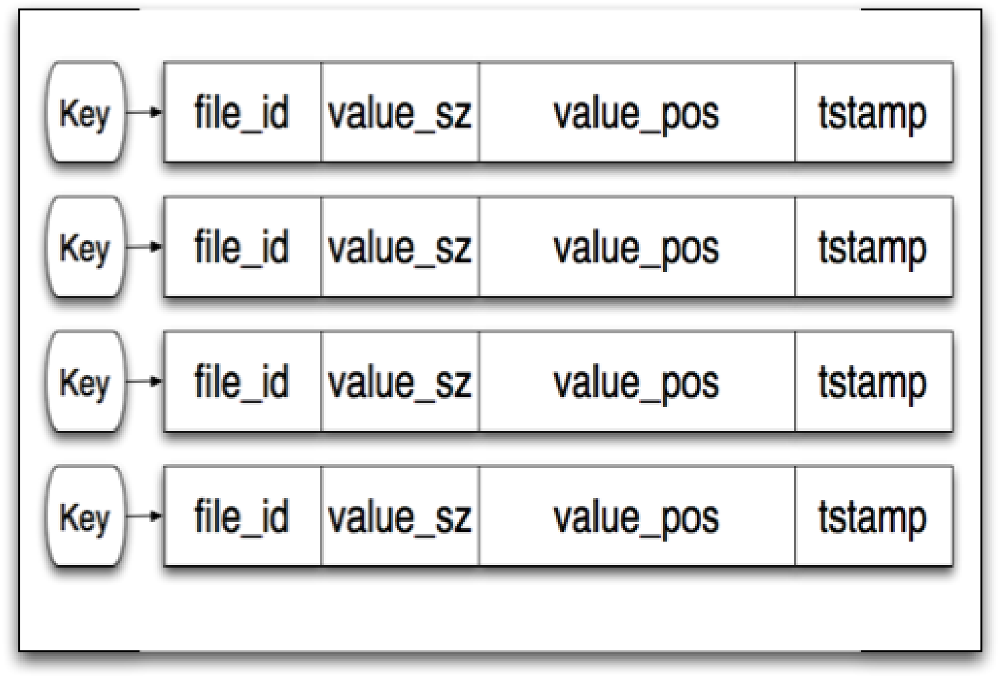
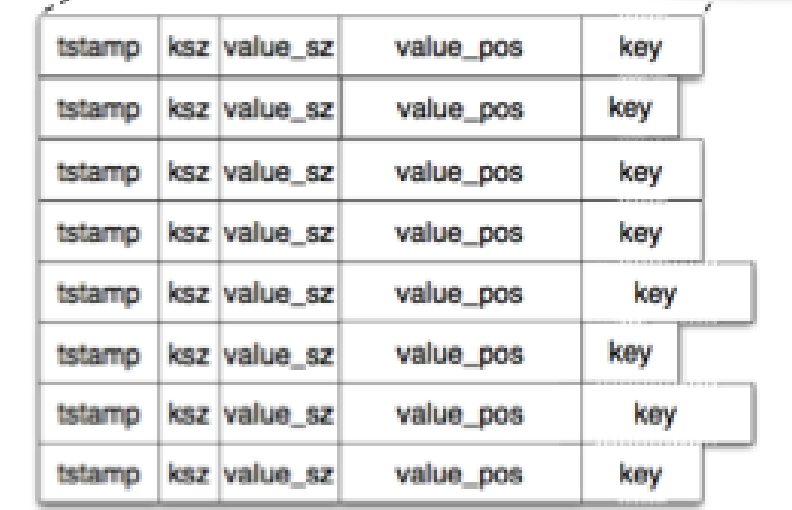

+++
title = "BitCask a hash table based merge tree"
description="Notes on the bitcask paper"
date = 2024-06-21

[taxonomies]
categories = ["programming", "papers"]

[extra]
+++

# [Overview]
[overview]: #overview

As a part of a exercise in learing distributed databases from first principals, I came across the [Bitcask paper][bitcask-paper] which describes the implementation of a log-structured Hash table. Here are some of my notes on the paper.

[bitcask-paper]: https://riak.com/assets/bitcask-intro.pdf

From the start, the authors focued on plugagable storage, allowing them to test different kinds of storage engines.

They laid out the following goals for the databse(paraphrasing):

* Low latency single item reads and write
* High throughput for streaming random writes
* Larger than RAM data sets without any performance degradation
* Crash recovery and durability
* Easy backup and reetore

The key insight they presented was to combine the amortized constant time semantics of Hash tables with the write performance characteristics of LSM trees.

# [Working model]
[working model]: #working-model

The model for a bitcask database is based off a single directory which is the `Bitcask` containing the data files. At any given point, only one of them is open for 

    The paper also calls out the fact that only one process can ever open the active file with read write permissions.
. Once the size of the active file reaches a certain threshold, a new file is opened for writing and the previous file is considered immutable. 

An interesting note here is by ensuring that the active file is only append only, when using spinning rust, you don't need a disk seek to write the latest entry. The old, data files are considered immutable and only ever read from. In addition to that, deletions are tombstone values which are appended. This could be a problem for the `get` path, but the authors handle this via using a `KeyDir` structure which I'll go into soon.

# [Entry format]
[entry format]: #entry-format

Each entry on disk is of variable length, using a length prefix encoding for the keys and values. The paper does not prescribe good defaults for these values. 

And as you can see, the structure includes and internal only timestamp along with a CRC to wrap the whole thing for data integrity.

# [Keydir]
[keydir]: #keydir

This is where the hash table part of the "Hash table merge tree" comes in. All the active keys and their latest location on disk is stored in memory in the `KeyDir` structure. Both the keys and values are fixed size, which I suspect allows for 

    The resizing behaviour of most hashtables might not be what we want for an in memory structure which which more likely than not would reach a stable size. I wonder what kind of a data structure would fit this use case better.


During updates, the keydir is updated along with the on disk structure. The paper does not go into the specfics of the locking protocol for this step, but one can imagine a protocol which provides serializability.

## Lookup request path
When a write occurs, the `KeyDir` is automatically updated with the latest location, so a lookup goes through the following steps

1. Get `file_id` from key dir
1. Get `file_id` file from cask
1. Seek to `value_pos` within file
1. Read `value_sz` bytes.
According to the authors, the file system cache does a good job of keeping the hot files cached.

# Merging
[merging]: #merging

Since data files are only ever appended to, over time, there the amount of tombstones will keep increasing. While I think this is strictly not an issue for the functionaing of the database, since the `KeyDir` will always point to the location on disk. The authors do however describe a process by which the immutable data files are compacted by removing old entries and tombstone values.

As a part of this process, they also describe the creation of a "hint file" which contains of entries similar to that in the data file itself, but omits the value. This file is then used to speed up the  construction of the `KeyDir` structure when the database first starts up.

The system is built in the context of running on the Erlang VM, and it is brought up in various places in paper. One interesting note is how the database is served concurrently across multiple processes. If an Erlang process starts up, it can check if an existing processin the same VM is already accessing this cask, and if so 

    My guess is, Erlang's message passing construct probably comes into play to gain access to the keydir structure for the read path.
 

# Conclusion

The paper concludes with notes on how well the database structure described meets the requirements that were set out at the start. In general, the paper describes a fairly straightforward impelemntation, that has clear semantics and should be pretty fun to implement.